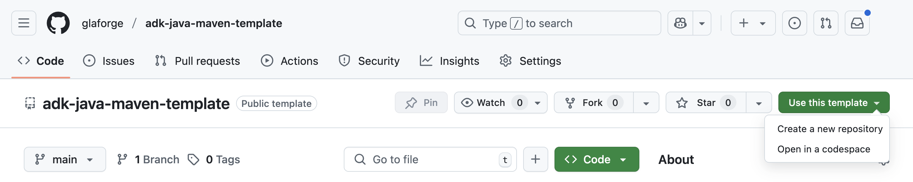
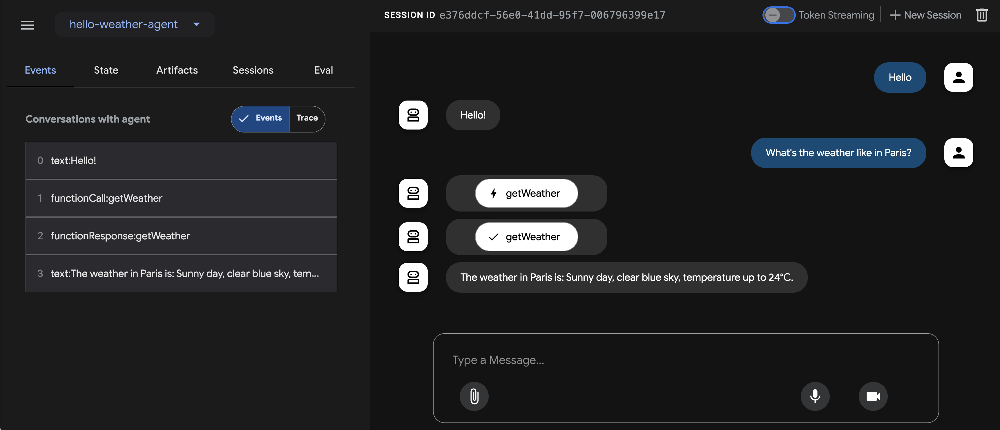

# Template project for building Java agents with ADK

## tips for java google adk

- [google adk for java github site](https://github.com/google/adk-java)  

- [Result information](https://github.com/glaforge/ai-agent-protocols/blob/main/adk/src/main/java/agents/adk/_20_StockTicker.java)  
- execute commnad 

```sh
mvn compile exec:java -Dexec.mainClass=com.example.agent.SupportAgent
```

### working sequence important

```sh
mvn compile exec:java -Dexec.mainClass=com.example.agent.PoetAndTranslator
```

주요 개념:
공유 상태: outputKey("key")는 에이전트의 결과를 공유 상태에 저장하며, 이 상태는 {key} 자리표시자를 사용하여 다음 에이전트의 명령에 삽입할 수 있습니다.

### agentic workflow - parallel works

작업이 독립적인 경우 ParallelAgent는 작업을 동시에 실행하여 효율성을 크게 높입니다. 다음 예에서는 SequentialAgent와 ParallelAgent를 결합합니다. 병렬 작업이 먼저 실행된 다음 최종 에이전트가 병렬 작업의 결과를 요약합니다.

다음과 같은 정보를 검색하는 회사 탐정을 만들어 보겠습니다.

회사의 프로필 (CEO, 본사, 모토 등)
회사에 관한 최신 뉴스
회사의 재무에 관한 세부정보입니다.

```sh
mvn compile exec:java -Dexec.mainClass=com.example.agent.CompanyDetective
```

### agentic workflow - duplicate imporevement 

'생성 → 검토 → 개선' 주기가 필요한 작업에는 LoopAgent를 사용합니다. 목표가 달성될 때까지 반복적인 개선을 자동화합니다. SequentialAgent와 마찬가지로 LoopAgent는 하위 에이전트를 순차적으로 호출하지만 시작 부분에서 다시 루프됩니다. 루프 실행을 중지하기 위해 특수 도구인 exit_loop 기본 제공 도구의 호출을 요청할지 여부를 결정하는 것은 에이전트가 내부적으로 사용하는 LLM입니다.

LoopAgent를 사용하는 아래 코드 리파이너 예시는 코드 리파이너를 자동화합니다(생성, 검토, 수정). 이는 인간의 발달을 모방합니다. 코드 생성기는 먼저 요청된 코드를 생성하고 generated_code 키 아래의 에이전트 상태에 저장합니다. 그런 다음 코드 검토자가 생성된 코드를 검토하고 의견을 제공하거나 (feedback 키 아래) 종료 루프 도구를 호출하여 반복을 조기에 종료합니다.


```sh
mvn compile exec:java -Dexec.mainClass=com.example.agent.CodeRefiner
```

LoopAgent를 사용하여 구현된 피드백/세부 조정 루프는 인간의 인지 프로세스를 긴밀하게 모방하여 반복적인 개선과 자기 수정이 필요한 문제를 해결하는 데 필수적입니다. 이 디자인 패턴은 코드 생성, 창작, 디자인 반복, 복잡한 데이터 분석과 같이 초기 출력이 완벽한 경우가 드문 작업에 특히 유용합니다. 구조화된 피드백을 제공하는 전문 검토자 에이전트를 통해 출력을 순환시킴으로써 생성 에이전트는 사전 정의된 완료 기준이 충족될 때까지 작업을 지속적으로 개선할 수 있으며, 단일 패스 접근 방식보다 훨씬 높은 품질과 신뢰할 수 있는 최종 결과를 얻을 수 있습니다.

주요 개념:

{key} vs. {key?}: 표준 {key} 문법은 공유 상태 (outputKey를 통해 저장됨)에서 콘텐츠를 삽입합니다. 여기에서 {feedback?}로 사용되는 {key?} 문법은 루프의 중요한 안전 메커니즘입니다. feedback 값을 삽입하려고 시도하지만, 키가 아직 설정되지 않은 경우 (검토자가 실행되기 전 첫 번째 반복 중인 경우) 물음표는 오류를 방지하고 대신 빈 문자열을 삽입합니다.
maxIterations() 안전망: LoopAgent.builder()에서 maxIterations(n)를 설정하는 것은 무한 루프를 방지하는 데 중요한 안전망입니다. LoopAgent 워크플로에서 검토자가 exit_loop를 호출할 때까지 주기가 계속됩니다. 검토자가 작업 완료를 감지하지 못하면 루프가 무한정 실행될 수 있습니다. maxIterations(n) 메서드는 설정된 횟수의 주기가 지난 후 루프가 종료되도록 합니다


This GitHub repository is a project template to get started creating your first 
agent with [ADK](https://google.github.io/adk-docs/) for Java, the open source
Agent Development Kit, and building with [Maven](https://maven.apache.org).


# Instructions

The following screenshot of the GitHub interface shows how you can use this template project to get started:



> [!TIP]
> * Check out the GitHub [documentation](https://docs.github.com/en/pull-requests/collaborating-with-pull-requests/working-with-forks/fork-a-repo)
> about forking and cloning template projects.
> * Read the [getting started guide](https://google.github.io/adk-docs/get-started/java/).
> * Be sure to read the [ADK documentation](https://google.github.io/adk-docs/get-started/quickstart/#set-up-the-model) 
> to better understand how to configure the model and API key.

# Setup

To use Gemini (or other supported models), you must set up the right environment variables for the model to be properly configured.

Set up the following environment variables:

```shell
export GOOGLE_API_KEY="PASTE_YOUR_ACTUAL_API_KEY_HERE"
export GOOGLE_GENAI_USE_VERTEXAI=FALSE
```

> [!TIP]
> You can get an API key in [Google AI Studio](https://aistudio.google.com/apikey).

> [!IMPORTANT]
> Be sure to replace `"PASTE_YOUR_ACTUAL_API_KEY_HERE"` above, with the value of the key.

# Running the agent

The `HelloWeatherAgent` class is a simple agent configured with one tool to request a canned weather forecast from any city.

There are two options to run your agent: 
* using the ADK Dev UI
* from the command-line

## Running the agent from the Dev UI

The Dev UI offers a useful chat interface to interact with your agent.
Run the command below to launch it, and open a browser at `http://localhost:8080/`.

```shell
mvn compile exec:java -Dexec.mainClass=com.example.agent.HelloWeatherAgent
```

In your browser, you can select the agent in the top left-hand corner and chat with it in the main chat space.
In the left panel, you can explore the various events, including function calls, LLM requests, and responses,
to understand what happens when a user converses with the agent.

Here's a screenshot of the Dev UI in action for your `HelloWeatherAgent` agent:



## Running the agent from the command-line

By default, the `main()` method of this agent launches the ADK Dev UI, on localhost:8080.
You can also comment this line launching the Dev UI and instead uncomment the custom run loop, if you want to run the agent from the terminal.

Type `quit` to exit the agent conversation.

Run the following Maven command to launch the agent in the terminal, after having uncommented the custom run loop:

```shell
mvn compile exec:java -Dexec.mainClass="com.example.agent.HelloWeatherAgent"
```

<details>
<summary>Expand to see the output</summary>

```
[INFO] Scanning for projects...
[INFO] 
[INFO] --------------------< com.example.agent:adk-agents >--------------------
[INFO] Building adk-agents 1.0-SNAPSHOT
[INFO]   from pom.xml
[INFO] --------------------------------[ jar ]---------------------------------
[INFO] 
[INFO] --- resources:3.3.1:resources (default-resources) @ adk-agents ---
[INFO] skip non existing resourceDirectory /Users/glaforge/Projects/adk-java-maven-template/src/main/resources
[INFO] 
[INFO] --- compiler:3.13.0:compile (default-compile) @ adk-agents ---
[INFO] Nothing to compile - all classes are up to date.
[INFO] 
[INFO] --- exec:3.6.1:java (default-cli) @ adk-agents ---

You > What's the weather in Paris?

Agent > The weather in Paris is sunny with a clear blue sky, and the temperature will be up to 24°C.

You > quit
[INFO] ------------------------------------------------------------------------
[INFO] BUILD SUCCESS
[INFO] ------------------------------------------------------------------------
[INFO] Total time:  51.659 s
[INFO] Finished at: 2025-10-12T13:07:47+02:00
[INFO] ------------------------------------------------------------------------
```

</details>

---

> [!NOTE]  
> This template project is not an official Google project 
